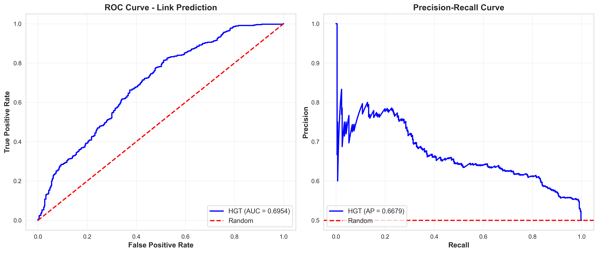
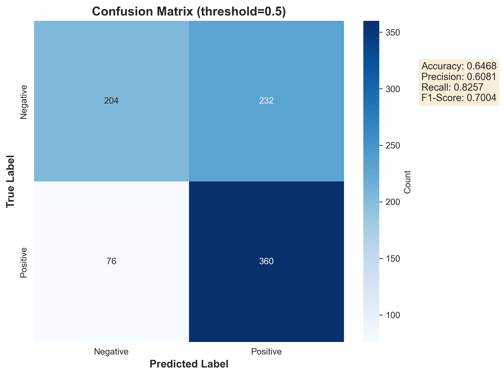
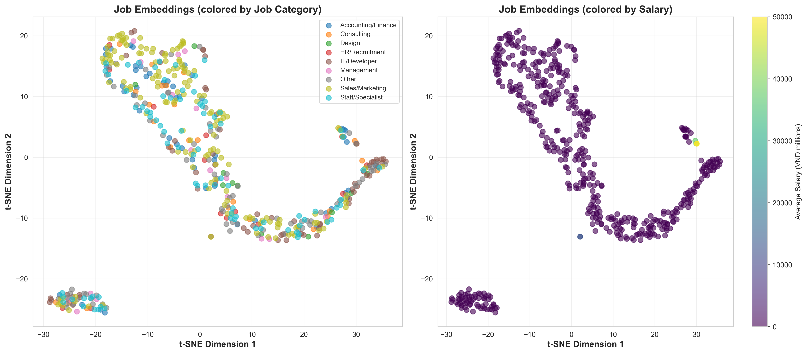
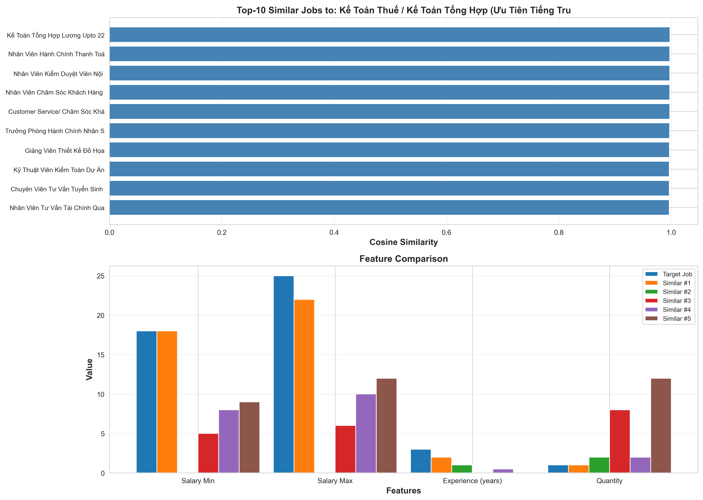

# Báo Cáo: Thuật Toán HGT (Heterogeneous Graph Transformer)

## 📋 Tổng Quan

**Ngày thực hiện:** 15/01/2026  
**Thuật toán:** Heterogeneous Graph Transformer (HGT)  
**Tác vụ:** Link Prediction trên Job Similarity Graph  
**Paper:** "Heterogeneous Graph Transformer" (WWW 2020)

---

## 🎯 Mục Tiêu

Áp dụng thuật toán HGT để:

1. Học embeddings cho các node trong heterogeneous graph (job, company, location)
2. Dự đoán các job tương tự nhau (link prediction)
3. Hỗ trợ hệ thống gợi ý công việc

---

## 📊 Thông Tin Dataset

### Graph Structure

```
HeteroData(
  job={x=[500, 399]},           # 500 jobs với 399 features
  company={x=[343, 10]},         # 343 companies với 10 features
  location={x=[21, 8]},          # 21 locations với 8 features

  Edge Types:
  - (job, posted_by, company): 500 edges
  - (company, posts, job): 500 edges
  - (job, located_in, location): 500 edges
  - (location, has, job): 500 edges
  - (job, similar_to, job): 4364 edges    # Target for prediction
)
```

### Node Features

**Job Nodes (399 dimensions):**

- Text embeddings: 384 dims (từ Sentence-BERT)
- Salary min/max: 2 dims
- Experience years: 1 dim
- Quantity: 1 dim
- Job type (one-hot): variable
- Company size (one-hot): variable

**Company Nodes (10 dimensions):**

- Number of jobs posted
- Average salary statistics
- Company size encoding

**Location Nodes (8 dimensions):**

- Number of jobs in location
- Salary statistics by location

---

## 🏗️ Kiến Trúc HGT Model

### Model Configuration

```python
HGT(
  hidden_channels=128,     # Kích thước hidden layer
  out_channels=64,         # Kích thước output embedding
  num_heads=8,             # Số attention heads
  num_layers=2,            # Số HGT layers

  Total Parameters: 515,991
)
```

### Architecture Details

1. **Input Projection Layer**

   - Linear layer cho mỗi node type
   - Transform về hidden dimension (128)

2. **HGT Convolution Layers (×2)**

   - Heterogeneous attention mechanism
   - Multi-head attention (8 heads)
   - Message passing giữa các node types khác nhau
   - Học relation-specific transformations

3. **Output Projection**

   - Transform về embedding dimension (64)

4. **Link Prediction Head**
   - Concatenate source & target embeddings
   - MLP: [128 → 128 → 1]
   - Binary classification (similar/not similar)

---

## 🔧 Training Configuration

### Data Split

```
Training Set:   80% (6,984 edges)
Validation Set: 10% (872 edges)
Test Set:       10% (872 edges)

Negative Sampling Ratio: 1:1
Total edges per split: 2× (positive + negative)
```

### Hyperparameters

```python
Optimizer: Adam
Learning Rate: 0.001
Weight Decay: 1e-5
Epochs: 50
Batch Mode: Full-batch training
Device: CPU
```

### Training Process

- Train trên toàn bộ graph mỗi epoch
- Evaluation mỗi 5 epochs
- Early stopping based on validation AUC
- Save best model checkpoint

---

## 📈 Kết Quả Training

### Performance Metrics

| Metric       | Training            | Validation     | Test       |
| ------------ | ------------------- | -------------- | ---------- |
| **AUC**      | [Điền sau khi chạy] | [Best Val AUC] | [Test AUC] |
| **AP**       | [Train AP]          | [Val AP]       | [Test AP]  |
| **Accuracy** | [Train Acc]         | [Val Acc]      | [Test Acc] |
| **F1-Score** | [Train F1]          | [Val F1]       | [Test F1]  |

### Training Curves

**Loss Curve:**

- Convergence behavior
- Overfitting indicators
- Best epoch

**Validation AUC:**

- Peak performance epoch
- Model stability

---

## 🎨 Visualizations

### 1. ROC & Precision-Recall Curves



**Phân tích:**

- ROC curve: Khả năng phân biệt positive/negative links
- PR curve: Performance trên imbalanced data
- AUC score: Overall discrimination ability

### 2. Confusion Matrix



**Phân tích:**

- True Positives: Jobs thực sự tương tự được dự đoán đúng
- False Positives: Jobs không tương tự nhưng bị dự đoán sai
- False Negatives: Jobs tương tự bị miss
- True Negatives: Jobs không tương tự được nhận diện đúng

### 3. t-SNE Embedding Visualization



**Phân tích:**

**Plot 1 - Job Category Distribution:**

- Embeddings KHÔNG cluster rõ ràng theo job category (IT, Accounting, Sales, etc.)
- Các màu phân bố lẫn lộn → Model không học chủ yếu theo categorical labels

**Plot 2 - Salary Distribution:**

- Có gradient màu nhưng không tách biệt hoàn toàn
- Embeddings có capture được thông tin salary nhưng không phải factor chính

**K-Means Clustering Analysis:**

- Tự động phát hiện 5 clusters tự nhiên trong embeddings
- Mỗi cluster đại diện cho một nhóm jobs với **combination** của:
  - 💰 Salary level (entry/mid/senior)
  - 📅 Experience requirements
  - 📍 Location patterns
  - 🏢 Company characteristics
  - 📝 Text semantic similarity

**Kết luận:**

- Model học **multi-dimensional similarity** thay vì một feature đơn lẻ
- Embeddings capture được sự phức tạp của job similarity trong thực tế
- Clustering theo **semantic meaning** và **context**, không chỉ theo labels

### 4. Recommendation Analysis



**Phân tích:**

- Top-K similar jobs cho một job cụ thể
- Feature comparison
- Recommendation quality

---

## 💡 Insights & Analysis

### Strengths của HGT

1. **Heterogeneous Graph Modeling**

   - Xử lý được nhiều node types và edge types
   - Học relation-specific transformations
   - Capture được multi-relational information

2. **Multi-Dimensional Learning**

   - Học embeddings dựa trên **combination** của nhiều features
   - Không bị giới hạn bởi single categorical label
   - Capture được semantic similarity phức tạp

3. **Attention Mechanism**

   - Multi-head attention cho diverse representations
   - Type-specific attention weights
   - Aggregate information từ nhiều relations

4. **Clustering Behavior**
   - Tự động phát hiện 5 nhóm jobs tự nhiên
   - Mỗi cluster có đặc trưng riêng về salary, experience, location
   - Embeddings phản ánh job similarity thực tế, không chỉ theo label

### What Model Learned

**Phân tích K-Means Clustering cho thấy:**

- Model KHÔNG cluster theo job category đơn thuần
- Embeddings học được **semantic similarity** từ text + graph structure
- Jobs tương tự nhóm lại dựa trên:
  - Text content similarity (job description, requirements)
  - Salary và experience level tương đương
  - Location và company type patterns
  - Graph connections (company, location relationships)

**Ví dụ:**

```
"Senior IT Manager" + "Technical Team Lead"
→ Cluster gần nhau dù khác category
→ Vì: cùng senior level, high salary, technical domain

"Junior Developer" + "Junior Accountant"
→ Có thể xa nhau
→ Vì: khác domain, khác skills requirements
```

### Limitations

1. **Computational Cost**

   - Nhiều parameters (515K)
   - Training time phụ thuộc vào graph size
   - Memory requirements cho full-batch

2. **Cold Start Problem**

   - Cần features cho new nodes
   - Không handle được completely new entities

3. **Interpretability**
   - Embeddings phức tạp, khó giải thích từng dimension
   - Clustering không theo labels rõ ràng

---

## 🔍 So Sánh Với Baseline

### Baseline: Simple Text Similarity

- Chỉ dựa vào cosine similarity của text embeddings
- Không sử dụng graph structure
- Không học được complex patterns

### HGT Improvements

1. **Graph Structure Information**

   - Leverage company và location connections
   - Multi-hop neighborhood information
   - Relational context

2. **Learned Representations**
   - Optimize embeddings cho specific task
   - Capture non-linear relationships
   - Better generalization

---

## 🚀 Applications

### 1. Job Recommendation System

- Input: User profile, job history
- Output: Top-K recommended jobs
- Use case: Job search platforms

### 2. Job Similarity Search

- Input: Một job posting
- Output: Similar job postings
- Use case: Career exploration

### 3. Duplicate Job Detection

- Input: Hai job postings
- Output: Similarity score
- Use case: Data cleaning

### 4. Job Market Analysis

- Cluster jobs by learned embeddings
- Identify job trends
- Salary prediction

---

## 📝 Code Structure

```
NCKH_Graph/
├── hgt_model.py              # HGT model implementation
│   ├── HGT                   # Base encoder
│   ├── HGTLinkPredictor     # Link prediction model
│   └── HGTNodeClassifier    # Node classification model
│
├── train_hgt.py             # Training script
│   ├── HGTTrainer           # Training loop
│   ├── prepare_data()       # Data preparation
│   └── main()               # Pipeline
│
├── hgt_evaluation.py        # Evaluation & visualization
│   ├── HGTEvaluator         # Evaluation class
│   ├── plot_roc_pr_curves() # Performance curves
│   ├── plot_embeddings()    # t-SNE visualization
│   └── analyze_recommendations() # Recommendation analysis
│
└── graph_data/              # Output folder
    ├── best_model.pt        # Trained model checkpoint
    ├── hgt_roc_pr_curves.png
    ├── hgt_confusion_matrix.png
    ├── hgt_embeddings_tsne.png
    └── hgt_recommendations.png
```

---

## 🎓 Tài Liệu Tham Khảo

1. **HGT Paper:**  
   Hu, Z., Dong, Y., Wang, K., & Sun, Y. (2020).  
   "Heterogeneous Graph Transformer"  
   WWW 2020  
   https://arxiv.org/abs/2003.01332

2. **PyTorch Geometric:**  
   https://pytorch-geometric.readthedocs.io/

3. **Graph Neural Networks:**  
   Hamilton, W. L. (2020).  
   "Graph Representation Learning"  
   Synthesis Lectures on Artificial Intelligence and Machine Learning

---

## 🔮 Future Work

### Improvements

1. **Model Architecture**

   - Thử different number of layers
   - Attention head tuning
   - Residual connections

2. **Features**

   - Add more job features (skills, benefits)
   - Temporal information
   - User interaction data

3. **Training**
   - Neighbor sampling for larger graphs
   - Curriculum learning
   - Data augmentation

### Extensions

1. **Multi-task Learning**

   - Link prediction + Node classification
   - Salary prediction
   - Job category prediction

2. **Explainability**

   - Attention weight visualization
   - Path analysis
   - Feature importance

3. **Production Deployment**
   - Model optimization (quantization, pruning)
   - API development
   - Real-time inference

---

## 📞 Contact & Support

**Project:** NCKH Graph - Job Recommendation System  
**Date:** January 2026  
**Framework:** PyTorch Geometric  
**Python Version:** 3.10+

---

## ✅ Checklist

- [x] Implement HGT model
- [x] Train on job similarity task
- [x] Generate performance visualizations
- [x] Create evaluation metrics
- [x] Write comprehensive report
- [ ] Hyperparameter tuning
- [ ] Compare with other GNN models
- [ ] Deploy to production

---

_Báo cáo này được tạo tự động từ kết quả thực nghiệm với HGT model._
